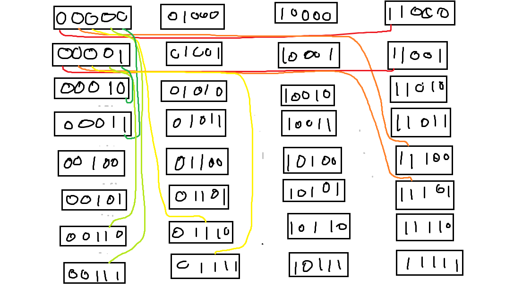
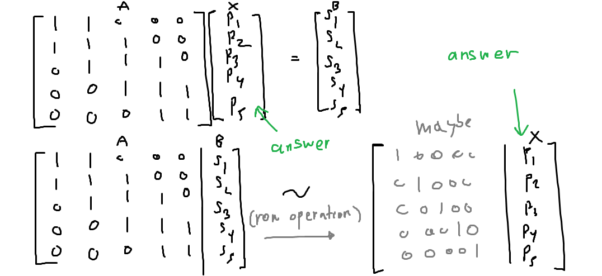
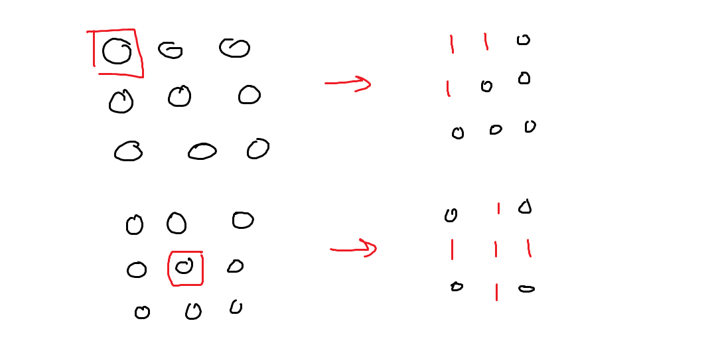

# วิธี Greedy
_หาจำนวนครั้งน้อยสุดได้ สำหรับปัญหาแบบง่ายเท่าั้น_

## เส้นตรงแบบง่าย

**ปัญหา**: มีไฟอยู่ n หลอด ไฟแต่ละดวงมีสวิตซ์อยู่ โดยถ้ากดสวิตซ์ของไฟดวงที่ i จะทำให้ไฟดวงที่ i-1, i และ i+1 เปลี่ยนสถานะ (จากเปิดเป็นปิด จากปิดเป็นเปิด) ยกเว้นไฟซ้ายสุดและขวาสุด เพราะว่า ถ้ากดไฟดวงที่ 1 มันจะต้องมีผลต่อดวงที่ 0 ด้วย แต่ดวงที่ 0 ไม่มีอยู่จริง

สมมุติให้ 0 แทนปิด 1 แทนเปิด มีไฟ 8 ดวง ต้องการเปลี่ยนจาก 00010110 เป็น 11111111 (เปิดทั้้งหมด) ทำได้ดังนี้

- **000**10110
- 11110**110**
- 1111**000**1
- 11111111

สังเกต
**0**0010110

ไฟดวงซ้ายสุดนี้ ไม่มีวิธีเปลี่ยนสถานะอื่นเลย นอกจากกดสวิตซ์ที่อยู่ไฟดวงที่ 2 (อย่าลืมว่าไฟดวงแรกเรายกเว้นไป เลยไม่มีสวิตซ์ให้กด) ดังนั้น ถ้าเราต้องการให้มันเปิด เราจำเป็นต้องกดสวิตซ์นี้

- **000**10110
- 11110110

ต่อมา พิจารณาไฟดวงถัดมา
1**1**110110

สังเกตว่าไฟดวงนี้ นอกจากสวิตซ์แรกที่เราจำเป็นต้องกดไปแล้ว ก็ไม่มีสวิตซ์อื่นนอกจากสวิตซ์ของไฟดวงที่ 3 ที่สามารถเปลี่ยนสถานะของไฟดวงนี้ได้ และเนื่องจากไฟดวงนี้เปิดอยู่แล้ว สวิตซ์นี้จึงไม่ต้องกด

พิจารณาไฟดวงถัดไปเรื่อย ๆ ในลักษณะเดียวกัน คือ ถ้าไฟซ้ายสุดของสวิตซ์ไหนยังปิดอยู่ ต้องกดให้ไฟเปิด ถ้าเปิดอยู่แล้วก็ไม่ต้องกด

- **000**10110 - ต้องกด
- 1**111**0110 - ไม่ต้องกด
- 11**110**110 - ไม่ต้องกด
- 111**101**10 - ไม่ต้องกด
- 1111**011**0 - ต้องกด
- 11111**000** - ต้องกด
- 11111111

อาจจะมีบางกรณีที่แก้ไม่ได้ เช่น หลอดไฟ 8 ดวงแบบนี้
- **000**00000
- 111**000**00
- 11111100

เมื่อมาถึงตำแหน่งนี้ แล้วไม่มีสวิตซ์อื่นให้กดแล้ว (อย่าลืม สวิตซ์ของไฟขวาสุดกดไม่ได้ เพราะเรายกเว้นไว้)

## แบบเส้นตรง ยากขึ้นมานิดนึง

**ปัญหา**: มีไฟอยู่ n หลอด ไฟแต่ละดวงมีสวิตซ์อยู่ โดยถ้ากดสวิตซ์ของไฟดวงที่ i จะทำให้ไฟดวงที่ i-1, i และ i+1 เปลี่ยนสถานะ (จากเปิดเป็นปิด จากปิดเป็นเปิด) - สำหรับปุ่มของไฟดวงที่ 1 จะมีผลกับไฟดวงที่ 1 และ 2 เท่านั้น ส่วนไฟดวงที่ n จะมีผลกับไฟดวงที่ n-1 และ n (คือ ตรงไหนเกินขอบไปถือว่าไม่มีผลตรงนั้น)
เช่น 00**0** ถ้ากดปุ่มขวาสุด ก็จะกลายเป็น 011

ยังสามารถแก้ได้ง่าย ๆ วิธีหนึ่งที่เป็นไปได้คื แจกแจงกรณีว่าเราต้องการกดสวิตซ์ซ้ายสุดหรือไม่ เช่น 00010110 เราจะเลือกว่า เราควรกดปุ่มซ้ายสุดให้กลายเป็น **11**010110 หรือไม่กด - เราจะแก้ทั้ง 00010110 และ 11010110 ตามวิธีแรก ถ้าได้วิธีออกมาก็ทั้งคู่ก็เลือกวิธีที่ใช้จำนวนครั้งน้อยสุด ถ้าได้อันเดียวก็เอาอันนั้น ถ้าไม่ได้ทั้งคู่ก็สรุปว่าไม่สามารถแก้รูปแบบหลอดไฟที่กำหนดให้มาได้

อันนี้วิธีแบบ greedy ซึ่ง ถ้ากำหนดหลอดไฟมาให้ n ดวง ปกติแล้ว เวลาที่ต้องใช้ในการหาวิธีการแก้ มีความสัมพันธ์เชิงเส้นกับ n (กล่าวคือ time complexity = O(n) )

นอกจากนี้ยังใช้กับแบบวงกลมได้ด้วย วิธีคล้ายๆกัน คือเลือกจุดยึดวงกลมไว้ แล้วเลือกกรณีความเป็นไปได้ของสวิตซ์สองปุ่มนั้น

# วิธีแบบกราฟ (ใช้ได้ทุกแบบ)
_หาจำนวนครั้งน้อยสุดได้ แต่ช้ามาก_

เป็นวิธีแจกแจงกรณีสถานะทั้งหมดที่เป็นไปได้ โดยเชื่อม edge ระหว่างคู่สถานะใด ๆ ถ้าเราสามารถเปลี่ยนสถานะไปมาได้โดยการกดสวิตซ์หนึ่งครั้ง แล้วหาเส้นทางสั้นสุดจากสถานะเริ่มต้นไปยังสถานะที่เราต้องการ วิธีนี้ เนื่องจากต้องแจกแจงกรณีสถานะทั้งหมดที่เป็นไปได้ 2^n แบบ จึงเป็นวิธีที่ใช้เวลานานกว่า greedy มาก - เหมาะสำหรับให้คอมพิวเตอร์คำนวณ แต่ถึงคอมพิวเตอร์ ก็ยังแก้ได้แค่ไฟไม่เกิน 30 ดวงเท่านั้น (เกินนี้จะนานมาก)

ในตัวโครงงาน ตัดสินใจกันเอาเองว่าจะเอาวิธีกราฟขึ้นก่อน แล้วตามด้วยวิธี greedy หรือจะเอา greedy ขึ้นก่อน แล้วตามด้วยกราฟ (greedy นี่ แนะนำให้เขียน proof แบบดีๆนิดนึง ว่าวิธีเรามันใช้ได้ ตามเหตุผลที่บอกไปคือ ไฟบางดวงมันมีสวิตซ์เดียวที่ทำให้มันเปลี่ยนสถานะได้)

ยกตัวอย่างวิธีแบบกราฟ สำหรับไฟ 5 ดวง

(นี่แหละเหตุผลที่อยากทำเรื่อง maxflow มากกว่า เพราะอันนี้ใช้เวลาคำนวณเยอะมาก แค่หลอดไฟ 5 หลอด มี 2^5 = 32 node แล้ว แต่ละ node มีเชื่อมต่ออีก 5 เส้น รวมเป็น (32*5)/2  = 90 เส้นในกราฟ)

เมื่อเราต้องการหาวิธีเปลี่ยนจากสถานะหลอดไฟ 00000 ไป 11111 ก็ให้หาเส้นทางเดินจาก 00000 ตามเส้นไป จนถึง 11111 - ถ้าอยากหาวิธีที่ใช้จำนวนครั้งน้อยสุดก็สามารถใช้ Dijkstra's Algorithm ได้ (เนื่องจากกราฟเป็นกราฟที่มีน้ำหนักเท่ากันหมด จะเรียกว่าเป็น Breadth-first Search ก็ได้)

# วิธี Matrix (ใช้ได้ทุกแบบ)

_หาได้เร็วมาก สำหรับทุกกรณี แต่ไม่รับประกันว่าจะได้วิธีที่จำนวนครั้งในการกดสวิตซ์น้อยสุด_

จะสังเกตได้ว่า การเปลี่ยนสถานะของไฟแต่ละดวง สามารถเขียนได้ในรูปของเมทริกซ์ เช่น สำหรับกรณีไฟ 5 ดวง (และมีสวิตซ์ตรงดวงที่ 1 และ 5 ด้วย)

- s1 = p1 + p2
- s2 = p1 + p2 + p3
- s3 = p2 + p3 + p4
- s4 = p3 + p4 + p5
- s5 = p4 + p5
- สมการทั้งหมดคำนวณใน modulo 2

เมื่อ si แทน การเปลี่ยนสถานะของไฟดวงที่ i และ pi แทน จำนวนครั้งที่กดสวิตซ์ที่ i

ยกตัวอย่าง หลอดไฟดวงที่่ 3 สังเกตได้ว่า จะมีสวิตซ์ที่ 2, 3 และ 4 เท่านั้นที่ส่งผลต่อหลอดไฟดวงที่ 3 ได้ โดยถ้ากดรวมจำนวนครั้งเป็นเลขคี่ ไฟดวงที่ 3 จะเปลี่ยนสถานะ แต่ถ้ากดรวมจำนวนครั้งเป็นเลขคู่ ไฟดวงที่ 3 จะไม่เปลี่ยนสถานะ (จึงต้องคำนวณสมการใน modulo 2)

หากเป้าหมายของเราคือ ต้องการเปลี่ยนไฟทั้ง 5 ดวง จากปิดเป็นเปิด กล่าวคือ ไฟทั้ง 5 ดวงมีการเปลี่ยนสถานะ เราจะให้ s1 = s2 = s3 = s4 = s5 = 1 แล้วแก้สมการหาค่า p1, p2, p3, p4, p5 เพื่อนำมาเป็นคำตอบว่า ต้องกดสวิตซ์ใดบ้าง

ในที่นี้ สามารถใช้ความรู้เรื่องเมทริกซ์ ทำให้แก้สมการได้รวดเร็วขึ้น

สังเกตว่าเมทริกซ์ที่กำหนดให้ AX=B พอดี โดย AX กับ B มีความสัมพันธ์ดังสมการที่กล่าวมาข้างต้น

เราจะใช้วิธี Gaussian Elimination ในการเปลี่ยนเมทริกซ์ให้อยู่ในรูป Reduced Row Echelon Form

ถ้าสามารถเปลี่ยนเมทริกซ์ให้เป็นเมทริกซ์เอกลักษณ์ได้ดังรูป เราจะได้คำตอบเป็น p1, p2, p3, p4, p5 ทันที แต่ในกรณีที่ไม่สามารถเปลี่ยนเป็นเมทริกซ์เอกลักษณ์ได้ แปลว่ามีหลายคำตอบ หรืออาจจะไม่มีคำตอบ (คล้ายการแก้สมการทั่วไป)

นอกเหนือจากนี้ วิธีเมทริกซ์สามารถใช้แก้โจทย์นี้ในกรณีแบบอื่นด้วย เช่น มีไฟและปุ่มเรียงกันเป็นตารางขนาด 3x3 โดยเมื่อกดปุ่มใด ๆ ไฟที่อยู่ทางด้านบน/ซ้าย/ล่าง/ขวาจะเปลี่ยนสถานะตามไปด้วย

เราสามารถแก้ได้โดยกำหนดช่องแต่ละช่องเป็นตัวเลข 1-9 แล้วเขียนเมทริกซ์ A โดยให้ แถวที่ i หลักที่ j มีเลข 1 ก็ต่อเมื่อ การกดสวิตซ์ที่ j จะทำให้สถานะของไฟหลอดที่ i เปลี่ยนไป จึงจะได้สมการที่มีความสัมพันธ์กับการเปลี่ยนสถานะไฟ แล้วจึงนำมาแก้สมการหาว่าต้องกดปุ่มใดได้บ้าง

แน่นอนว่าใช้กับสามมิติ หรือกรณีที่สวิตซ์เชื่อมกับไฟใด ๆ ได้หมด ถ้าเขียนเมทริกซ์ให้ตรงตามเงื่อนไขด้านบนได้

ถ้าเมทริกซ์ A ที่เขียนไม่เป็นเมทริกซ์จัตุรัส (จำนวนหลอดไฟและสวิตซ์ไม่เท่ากัน เช่นในกรณีปัญหาแบบง่ายที่ยกตัวอย่างตอนแรก) เราสามารถเติมหลอดไฟหรือสวิตซ์จนครบได้ เช่น ในตัวอย่างแรก เราอาจจะเพิ่มสวิตซ์ที่ไม่มีผลต่อสถานะหลอดไฟใด ๆ ได้

ควรทำให้เป็นเมทริกซ์จัตรุัส เพราะสามารถใช้ Guassian Elimination ในการแก้สมการได้ 

Gaussian Elimination ใช้เวลาประมาณ O(n^3) เมื่อเมทริกซ์มีขนาด n*n

# สรุปเรื่องที่เกี่ยวข้อง

- Graph: Shortest Path Problem (Dijkstra's Algorithm)
- Matrix: Solving Linear Equation
- Time Complexity ใช้วิเคราะห์เวลาการทำงาน

[เนื้อหาเกี่ยวกับเกมนี้ใน Wikipedia](https://en.wikipedia.org/wiki/Lights_Out_(game))